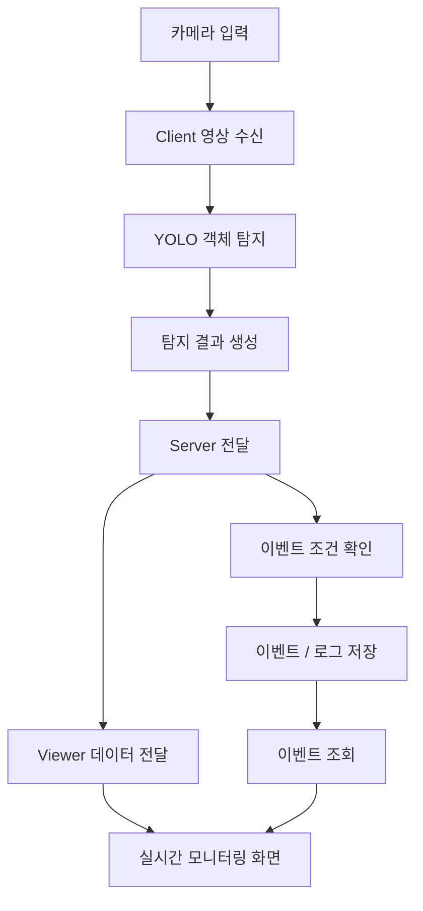

# AI Safety Monitoring System

> **YOLO 기반 산업 안전 영상 관제 시스템을 분석하고, Client–Server–Viewer 구조와 UI를 개인 포트폴리오 형태로 재구성한 프로젝트**

산업 현장의 CCTV·웹캠 영상에서 작업자와 안전모 착용 여부를 탐지하고,  
탐지 결과를 중앙 서버와 관제 Viewer로 전달하는 **AI 안전 관제 시스템**입니다.

이 저장소는 기존 팀 프로젝트 결과물을 그대로 제출하기 위한 것이 아니라,  
팀 프로젝트에서 사용한 전체 구조를 다시 분석하고 **실제 운용 프로그램 관점에서 UI와 코드 구조를 개인화·정리한 포트폴리오 프로젝트**입니다.

---

## 프로젝트 핵심

- YOLO 기반 **작업자 / 안전모 착용 / 안전모 미착용 객체 탐지**
- Flutter 기반 **Client / Viewer 데스크톱 UI**
- Python 기반 AI 추론 및 Backend 연동
- 중앙 Server를 기준으로 한 **Client–Server–Viewer 구조 분석**
- YOLO26n / s / l 모델 성능 비교
- 다중 카메라 환경의 실시간성을 고려한 모델 선정
- 기존 팀 프로젝트 UI를 **운용 프로그램 형태로 재구성**
- 카메라·서버·AI 추론 상태를 한 화면에서 확인할 수 있도록 화면 구조 개선
- 실행·빌드·네트워크 흐름을 다시 정리하며 전체 파이프라인 분석

---

# 개인 포트폴리오에서의 핵심

## 기존 결과물을 그대로 사용하지 않은 이유

팀 프로젝트에서는 여러 팀원이 AI 학습, 서버, Client, Viewer 등 각 기능을 나누어 개발했습니다.

개인 포트폴리오에서는 단순히 팀 결과물을 제출하지 않고 다음 흐름을 직접 다시 확인했습니다.

```text
Camera
   ↓
AI Client
   ↓
AI Inference
   ↓
Central Server
   ↓
Monitoring Viewer
```

각 프로그램이 어떤 데이터를 만들고 전달하는지 분석한 뒤,  
**Client와 Viewer를 실제 관제·운용 프로그램에 가까운 형태로 재구성하는 것**을 개인화의 중심으로 잡았습니다.

---

## 나의 중점 학습 및 수행 내용

### 1. 팀 프로젝트에서 수행한 내용

- 안전모 탐지용 데이터 라벨링 및 데이터 증강 참여
- YOLO 모델 학습 및 결과 비교
- YOLO26n / YOLO26s / YOLO26l 성능 비교
- Precision / Recall / mAP / FPS / GFLOPs 비교
- 실시간 다중 카메라 환경을 고려한 모델 선택 과정 참여
- Client–Server–Viewer 기반 전체 서비스 흐름 분석

### 2. 개인 포트폴리오에서 수행한 내용

- 기존 팀 프로젝트 전체 폴더 및 실행 구조 재분석
- Flutter Client 화면 구조 분석
- Flutter Viewer 화면 구조 분석
- Embedded Python Backend와 Flutter 연결 구조 확인
- Client UI 전면 재구성
- Viewer UI 전면 재구성
- 카메라 / 서버 / AI 추론 상태를 확인할 수 있는 UI 구성
- 반복되는 UI 요소의 공통화 및 화면 구조 정리
- 기능 코드와 화면 코드의 역할을 구분하도록 구조 정리
- 실행 및 빌드 과정 재정리
- localhost / Server IP 기반 접속 구조 확인
- Windows 환경에서 Flutter와 Python Backend를 함께 실행하는 과정 학습
- 기존 팀 프로젝트를 개인이 설명할 수 있도록 전체 데이터 흐름 문서화

---

# 기존 팀 프로젝트와 개인화 버전 비교

| 구분 | 기존 팀 프로젝트 | 개인 포트폴리오 버전 |
| --- | --- | --- |
| 개발 목적 | 팀 단위 기능 구현 및 시연 | 구조 이해 및 개인 포트폴리오화 |
| UI | 기능 구현 중심 | 실제 운용 프로그램 형태로 재구성 |
| Client | 카메라 및 추론 실행 중심 | 상태 확인과 운용 편의성을 고려한 화면 |
| Viewer | 관제 기능 중심 | 다중 카메라 관제를 고려한 화면 재구성 |
| 코드 이해 | 팀원별 기능 분담 | 전체 Client–Server–Viewer 흐름 재분석 |
| 상태 표현 | 기능별 표시 | Camera / Server / Inference 상태를 명확히 표시 |
| 유지보수 | 팀 개발 구조 | 화면과 기능의 역할을 구분하도록 정리 |
| 포트폴리오 관점 | 팀 결과물 | 직접 분석·수정한 내용을 중심으로 재구성 |

---

# 시스템 아키텍처



---

## 구성 요소별 역할

| 구성 요소 | 역할 |
| --- | --- |
| **AI Client** | 카메라 연결, 영상 입력, YOLO 추론, 탐지 결과 및 상태 정보 처리 |
| **Central Server** | Client와 Viewer 사이의 데이터 전달 및 시스템 데이터 관리 |
| **Monitoring Viewer** | 카메라 영상 모니터링, 탐지 결과 및 시스템 상태 확인 |

개인화 과정에서는 단순히 화면을 수정하는 것보다  
**Client → Server → Viewer로 데이터가 이동하는 이유와 각 프로그램의 책임을 이해하는 것**에 중점을 두었습니다.

---

# AI 모델 선정 과정

## YOLO26n / s / l 비교

팀 프로젝트에서 동일 데이터셋을 기준으로 YOLO26n, YOLO26s, YOLO26l을 비교했습니다.

| 모델 | GFLOPs | Precision | Recall | mAP@50-95 | 추론 FPS |
| --- | ---: | ---: | ---: | ---: | ---: |
| **YOLO26n** | **5.77** | 0.8904 | 0.5742 | 0.3767 | **662** |
| YOLO26s | 22.50 | 0.9037 | 0.5886 | 0.3873 | 276 |
| YOLO26l | 93.13 | **0.9082** | **0.5964** | **0.3933** | 90 |

대형 모델로 갈수록 정확도 지표는 향상되었지만 연산량과 추론 속도 차이가 컸습니다.

개인 포트폴리오에서는 **다중 카메라를 동시에 처리하는 실시간 관제 환경**을 고려하여  
정확도만 가장 높은 모델보다 처리량과 지연 시간을 함께 고려하는 방향으로 시스템을 이해했습니다.

### 모델 비교를 통해 학습한 점

- 모델 선정은 단순히 가장 높은 mAP를 선택하는 과정이 아님
- 실제 서비스에서는 정확도와 함께 FPS, 지연 시간, GPU 사용량을 고려해야 함
- 카메라 수가 증가하면 한 프레임의 추론 속도 차이가 전체 시스템 처리량에 영향을 줌
- AI 모델의 성능과 실제 프로그램의 전체 FPS는 서로 다른 지표임

---

# 전체 처리 흐름

1. Client가 USB Camera 또는 영상 소스로부터 프레임을 입력받습니다.
2. Python 기반 AI 추론 영역에서 YOLO 모델이 객체를 탐지합니다.
3. 탐지 결과와 영상 데이터가 Client에서 처리됩니다.
4. 필요한 데이터가 중앙 Server로 전달됩니다.
5. Server가 연결된 Client 및 시스템 데이터를 관리합니다.
6. Viewer가 Server에서 전달받은 데이터를 이용해 관제 화면을 구성합니다.
7. 사용자는 Viewer에서 여러 카메라와 탐지 상태를 확인합니다.

```text
Camera
  ↓
Frame Capture
  ↓
YOLO Inference
  ↓
Detection Result
  ↓
Client
  ↓
Central Server
  ↓
Monitoring Viewer
```

---

# 주요 기능

## AI / Vision

- YOLO 기반 객체 탐지
- 작업자 탐지
- 안전모 착용 여부 탐지
- 실시간 카메라 프레임 처리
- 모델 크기별 성능 비교

## Client

- 카메라 연결 및 영상 확인
- AI 추론 실행
- 카메라 연결 상태 표시
- Server 연결 상태 표시
- AI 추론 상태 표시
- 운용 상태를 확인하기 쉽도록 UI 재구성

## Viewer

- 관제 화면 구성
- 여러 카메라를 고려한 화면 배치
- 카메라 및 시스템 상태 확인
- 기존 기능 중심 화면을 관제 프로그램 형태로 재구성

## Server / Network

- Client–Server–Viewer 데이터 흐름
- Server IP 기반 연결 구조
- 로컬 및 다른 PC 접속 환경 확인
- 프로그램별 역할 분리

---

# 기술 스택

| 영역 | 기술 |
| --- | --- |
| **AI / Computer Vision** | Python, YOLO, Ultralytics, OpenCV |
| **Desktop UI** | Flutter, Dart |
| **Backend** | Python, FastAPI |
| **Network** | TCP/IP, REST API |
| **Database / Data** | SQLite, JSON |
| **Development** | Git, GitHub, VS Code |
| **Target Environment** | Windows 10 / 11 |

> 이 표는 이 프로젝트에서 실제로 사용하거나 구조를 분석한 기술을 기준으로 작성했습니다.  
> 별도로 학습 중인 기술은 GitHub Profile의 `Keep Learning` 영역에서 구분합니다.

---

# 프로젝트 구조

```text
SafetyMonitor_Portfolio_v1/
│
├─ safety_monitor_client/
│  ├─ lib/
│  │  ├─ screens/              # Client 화면
│  │  ├─ widgets/              # 공통 UI 요소
│  │  └─ ...
│  │
│  └─ embedded_backend/
│     └─ app/
│        └─ analysis/           # Python AI 추론 관련 코드
│
├─ safety_monitor_server/
│  ├─ main.py                  # Server 진입점
│  └─ app/                     # API / Server 기능
│
├─ safety_monitor_viewer/
│  └─ lib/
│     ├─ screens/              # Viewer 화면
│     ├─ widgets/              # 공통 UI 요소
│     └─ ...
│
├─ check_environment.bat
├─ install_dependencies.bat
├─ build_client.bat
├─ build_viewer.bat
│
└─ README.md
```

> 실제 저장소 구조에 따라 일부 폴더명은 최종 정리 과정에서 변경될 수 있습니다.

---

# 실행 흐름

기본 실행 순서는 다음과 같습니다.

```text
Server
  ↓
Viewer
  ↓
Client
```

## 1. 환경 확인

```bat
check_environment.bat
```

## 2. 의존성 설치

```bat
install_dependencies.bat
```

## 3. Server 실행

Server를 먼저 실행하여 Client와 Viewer가 접속할 수 있도록 합니다.

## 4. Viewer 실행

Viewer에서 Server 주소를 확인하고 관제 화면을 실행합니다.

## 5. Client 실행

Client에서 카메라를 연결한 뒤 AI 추론 및 Server 연결 상태를 확인합니다.

---

# 네트워크

같은 PC에서 실행할 경우:

```text
127.0.0.1
```

다른 PC에서 중앙 Server에 접속할 경우:

```text
http://<SERVER_PC_IP>:8000
```

Client와 Viewer가 서로 직접 모든 기능을 처리하는 것이 아니라  
**Server를 중심으로 프로그램 역할을 분리하는 구조**를 학습하고 정리했습니다.

---

# Troubleshooting & Learning

개인화 과정에서는 기능 추가뿐만 아니라 기존 프로젝트를 다시 실행하면서 발생한 문제를 직접 확인하고 해결하는 과정도 중요하게 다뤘습니다.

## 1. Python Virtual Environment

### 문제

프로젝트 실행 과정에서 Python 가상환경이 존재하지 않거나 배치 파일에서 Python 명령을 찾지 못하는 문제가 발생했습니다.

### 확인한 내용

- Windows Python 설치 상태
- `python` / `py` 명령 인식 여부
- `.venv` 생성 위치
- Python Backend가 사용하는 패키지 설치 환경

### 학습

Flutter 프로젝트와 Embedded Python Backend를 함께 배포하려면  
UI 프로젝트뿐 아니라 Python 실행 환경까지 함께 고려해야 한다는 점을 확인했습니다.

---

## 2. Flutter Windows Build

### 문제

Flutter Windows 빌드 과정에서 SDK 경로 및 CMake 관련 오류를 확인했습니다.

### 확인한 내용

- Flutter SDK 경로
- Visual Studio C++ Build Tools
- Windows Desktop Build 환경
- Flutter package dependency
- CMake 기반 Windows plugin build

### 학습

Flutter는 UI 코드만 작성한다고 실행 파일이 만들어지는 것이 아니라  
Windows Native Build 환경과 연결된다는 점을 실제 오류를 통해 학습했습니다.

---

## 3. Server Address

### 문제

같은 PC에서는 `127.0.0.1`로 연결할 수 있지만 다른 PC에서는 동일 주소를 사용할 수 없습니다.

### 해결 방향

```text
같은 PC
Client / Viewer → 127.0.0.1 → Server

다른 PC
Client / Viewer → Server PC IPv4 → Server
```

### 학습

`localhost`는 현재 실행 중인 자신의 PC를 의미하므로  
다중 PC 환경에서는 중앙 Server의 실제 IPv4 주소를 사용해야 한다는 점을 확인했습니다.

---

## 4. 팀 프로젝트 코드 분석

### 문제

기존 프로젝트는 여러 팀원이 기능을 나누어 작성했기 때문에  
파일 수가 많고 Flutter, Python, Server 코드가 함께 존재해 처음에는 전체 실행 흐름을 파악하기 어려웠습니다.

### 접근 방법

```text
UI 버튼
   ↓
Flutter Service / State
   ↓
Embedded Backend
   ↓
Python AI
   ↓
Server API
   ↓
Viewer
```

기능 하나를 기준으로 호출 흐름을 따라가며 구조를 분석했습니다.

### 학습

프로젝트를 이해할 때 파일을 처음부터 모두 읽는 것보다  
**사용자 동작 → 함수 호출 → 데이터 전달 → 결과 출력** 순으로 추적하는 방식이 효과적이라는 점을 학습했습니다.

---

# 프로젝트를 통해 배운 점

이 프로젝트를 개인화하면서 AI 모델 학습만으로는 하나의 서비스가 완성되지 않는다는 점을 배웠습니다.

특히 다음 영역이 서로 연결되어야 실제 프로그램으로 동작한다는 것을 확인했습니다.

```text
AI Model
   +
Camera / Image Processing
   +
Backend
   +
Network
   +
Desktop UI
   +
Build / Runtime Environment
```

또한 팀 프로젝트에서 맡지 않았던 코드도 개인 포트폴리오로 다시 분석하면서  
**다른 사람이 작성한 코드를 읽고 전체 프로그램의 흐름을 파악하는 경험**을 할 수 있었습니다.

---

# 한계와 개선 방향

현재 개인 포트폴리오에서는 기존 시스템 분석과 Client / Viewer 재구성에 중점을 두었습니다.

향후에는 다음 항목을 추가로 개선할 계획입니다.

- 실제 RTSP CCTV 입력 지원
- 다중 Client / 다중 Viewer 환경 테스트
- 카메라 그룹 및 배치 관리 고도화
- 사용자 계정 및 권한 관리
- 이벤트 기록 및 영상 클립 관리 기능 개선
- Server DB 구조 개선
- 연결 끊김 감지 및 자동 재연결 강화
- EXE / Installer 형태의 배포 구조 개선
- 다른 PC에서 설치 후 실행 가능한 패키징 검증
- 운영 규모 확장을 고려한 서버 및 저장 구조 개선

---

# 프로젝트 정보

- **프로젝트 유형**: 팀 프로젝트 기반 개인 포트폴리오 재구성
- **분야**: AI Vision / Desktop Application / Backend / Network
- **주제**: 산업 안전 영상 관제 및 안전모 착용 여부 탐지
- **개인화 목적**: 기존 팀 프로젝트의 전체 구조 분석 및 운용 소프트웨어 형태로 재구성

---

## Contribution Note

본 프로젝트는 팀 프로젝트를 기반으로 합니다.

따라서 README에서는 다음 내용을 구분하여 작성했습니다.

- **팀 프로젝트에서 직접 수행한 내용**
  - 데이터 라벨링 및 증강
  - YOLO 모델 학습 및 비교
  - 모델 성능 분석

- **개인 포트폴리오에서 수행한 내용**
  - 기존 전체 프로젝트 구조 분석
  - Client / Viewer UI 재구성
  - 프로그램별 역할 및 데이터 흐름 분석
  - 실행·빌드·네트워크 환경 재정리
  - 개인 포트폴리오용 코드 및 문서 구조 정리

팀 프로젝트의 다른 팀원이 구현한 기능을 개인 단독 성과로 표현하지 않고,  
**직접 수행한 부분과 개인화 과정에서 새롭게 분석·수정한 부분을 중심으로 정리했습니다.**
